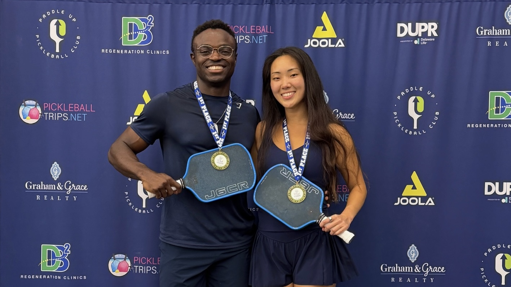
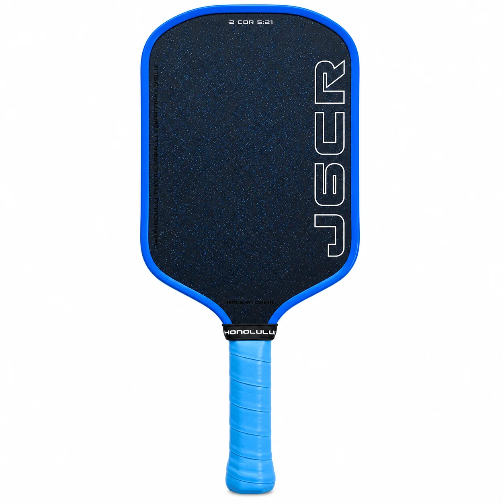

# Bekah & Tobi Pickleball

Everything related to Bekah & Tobi Pickleball in one place.

## Drill sessions with Tobi

[Link to drill sessions](https://app.courtreserve.com/Online/Events/List/10117/ALYVV2TTLQ10117?pageTitle=Chesterfield%20Training&rootCall=false)

## Favorite gear

### Honolulu J6CR

The paddle both Bekah and I use. It’s a great all-around option with solid power, control, and feel on the court.

- Price: ~$195
- **10% off with discount code "Ola"**
- [View Paddle](https://808pickle.com/products/j6cr)

### Accessories

- **Montis Pickleball Shoes** — Comfortable and reliable on court.
  - **10% off with discount code "Ola"**
  - [View Shoes](https://montispickleball.com)

- **Bodhi Pickleball Grips** — A simple upgrade I like.
  - **15% off with discount code "tobiola15"**
  - [View Grips](https://bodhiperformance.com?sca_ref=10692022.30F8BMfCGFe2BT7)

## Leagues

### Paddle Up Pickleball Leagues
- 6-week sessions
- Multiple level options
- Great for players looking to compete regularly

[View Leagues](https://www.paddleuppickleballclub.com/chesterfield)